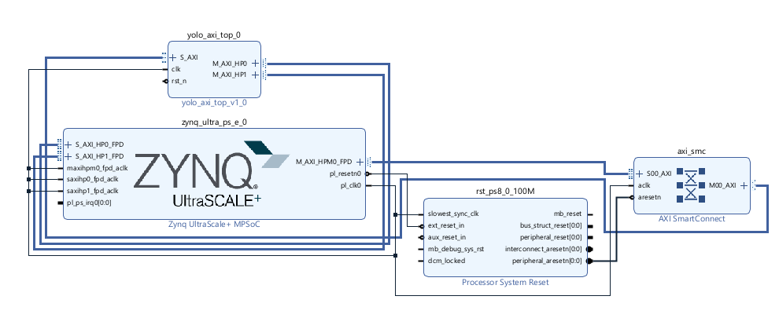

# YOLOv3-Tiny FPGA Accelerator

SystemVerilog implementation of YOLOv3-Tiny targeting Zynq UltraScale+ (Ultra96v2 / ZU3EG). Processes 416×416 RGB images with int8 quantized weights and outputs detections at 13×13 and 26×26 scales.


## Vivado Block Design


## Network topology

```
image (416×416×3)
    │
Conv1 (416×416×16)  → Pool1 (208×208×16)
Conv2 (208×208×32)  → Pool2 (104×104×32)
Conv3 (104×104×64)  → Pool3  (52×52×64)
Conv4  (52×52×128)  → Pool4  (26×26×128)
Conv5  (26×26×256)  → [save → route_buf] → Pool5 (13×13×256)
Conv6  (13×13×512)  → Pool6 (13×13×512, stride=1)
Conv7  (13×13×1024) → Conv8 (13×13×256) → [save → route8_buf]
Conv9  (13×13×512)  → YOLO Head 1 → det1 (13×13×255)
                       ↓
       ROUTE_RESTORE (reload route8_buf)
Conv10 (13×13×128)  → Upsample (26×26×128)
Concat (26×26×384)  ← route_buf (26×26×256)
Conv11 (26×26×256)  → YOLO Head 2 → det2 (26×26×255)
```

## Files

| File | Module | Description |
|---|---|---|
| `rtl/yolo_axi_top.sv` | `yolo_axi_top` | AXI top wrapper — BRAM tiles, DMA control, register map |
| `rtl/yolo_tiny_top.sv` | `yolo_tiny_top` | FSM sequencer, ping-pong buffers, layer wiring |
| `rtl/yolo_v1.sv` | `conv_2d`, `conv_chunk_fsm` | 2D conv, 64-wide MAC array, bias add, leaky ReLU, int8 clip |
| `rtl/mac.sv` | `mac_array`, `accumulator` | 64-parallel int8 MAC tree |
| `rtl/maxpool.sv` | `maxpool2d` | 2×2 max pool, configurable stride |
| `rtl/upsample.sv` | `upsample` | Nearest-neighbor 2× upsample |
| `rtl/routeconcat.sv` | `route_concat` | Channel-wise concat of two feature maps |
| `rtl/dp_bram.sv` | `dp_bram` | Dual-port BRAM tile (256 KB, 128-bit wide) |
| `rtl/axi_master_rd.sv` | `axi_master_rd` | AXI4 burst read master (DDR → BRAM) |
| `rtl/axi_master_wr.sv` | `axi_master_wr` | AXI4 burst write master (BRAM → DDR) |
| `rtl/axi_lite_slave.sv` | `axi_lite_slave` | AXI-Lite slave, 64-byte control register map |
| `rtl/op_units.sv` | `int_mul`, `int_add` | Signed int8×int8 multiply, int32 add |
| `rtl/leakyRELU.sv` | `leaky_relu` | Leaky ReLU, α=0.125 (right-shift by 3) |

## Data format

- **Weights**: signed int8, HWC order, all layers concatenated
- **Biases**: signed int32, all layers concatenated (batch-norm folded in)
- **Activations**: signed int8, HWC layout `[y * W * C + x * C + c]`
- **Output**: raw int8 feature maps (255 = 3 anchors × 85 values per cell)

### Weight/bias offsets

| Layer | K | C_in | C_out | Weight base | Bias base |
|---|---|---|---|---|---|
| Conv1  | 3 | 3    | 16   | 0         | 0    |
| Conv2  | 3 | 16   | 32   | 432       | 16   |
| Conv3  | 3 | 32   | 64   | 5040      | 48   |
| Conv4  | 3 | 64   | 128  | 23472     | 112  |
| Conv5  | 3 | 128  | 256  | 97200     | 240  |
| Conv6  | 3 | 256  | 512  | 392112    | 496  |
| Conv7  | 3 | 512  | 1024 | 1571760   | 1008 |
| Conv8  | 1 | 1024 | 256  | 6290352   | 2032 |
| Conv9  | 3 | 256  | 512  | 6552496   | 2288 |
| Conv10 | 1 | 256  | 128  | 7732144   | 2800 |
| Conv11 | 3 | 384  | 256  | 7764912   | 2928 |

## DDR memory layout

All buffers live in LPDDR4, allocated from Python via `pynq.allocate`:

| Buffer | Size | Contents |
|---|---|---|
| `weight_addr` | ~8.6 MB | all conv weights |
| `bias_addr` | 16 KB | all biases (int32) |
| `image_addr` | ~507 KB | input image (416×416×3) |
| `buf_a / buf_b` | ~2.6 MB each | ping-pong feature maps |
| `route_addr` | ~168 KB | saved Conv5 output (26×26×256) |
| `route8_addr` | ~42 KB | saved Conv8 output (13×13×256) |
| `det1_addr` | ~42 KB | detection head 1 output |
| `det2_addr` | ~168 KB | detection head 2 output |

On-chip BRAMs hold one tile at a time (ibram, wbram, obram — 256 KB each).

## AXI interfaces

| Interface | Type | Purpose |
|---|---|---|
| `S_AXI_LITE` | AXI-Lite slave | start/done flag, buffer base addresses |
| `M_AXI_HP0` | AXI4 master (128-bit) | DDR reads → BRAM |
| `M_AXI_HP1` | AXI4 master (128-bit) | BRAM writes → DDR |

## FPGA resource usage (ZU3EG, post-implementation)

| Resource | Used | Available |
|---|---|---|
| LUT | ~11k | 70,560 |
| FF | ~3k | 141,120 |
| BRAM18 | ~342 (171 RAMB36) | 432 |
| DSP | 103 | 360 |

Timing: WNS = +7.1 ns at 100 MHz (plenty of margin).

## Simulation

Individual module tests in `tb/`. Full-network simulation (`tb_yolo_tiny_top.sv`) is not practical at full 416×416 — a complete forward pass is hundreds of millions of cycles. Use it with reduced dimensions for FSM sanity checks, or test modules in isolation.

## Status

Bitstream generated and passing implementation for Ultra96v2. PYNQ runtime integration in progress.
